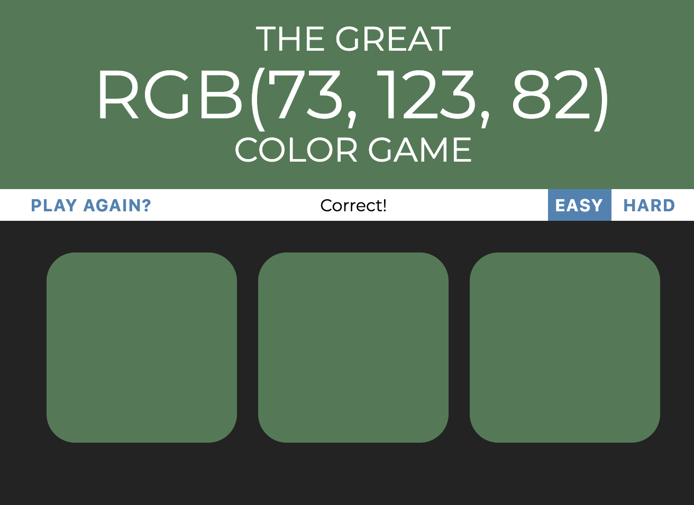

# Color Game   
#### Author: Jesnine Erillo   
This is one of the projects created for a web dev course offered on Udemy, 
using HTML/CSS/JS.

## How to play:
- There are two levels of difficulty:
    - Easy: Choose from 3 color swatches
    - Hard: Choose from 6 color swatches
- To win, click the color swatch that correspondes to the RGB description in
 the header.
- Once the game is won, the header changes to the winning color.
- To play again, select the "PLAY AGAIN?" button in the top left.
    
## Preview
#### Easy gameplay:
 

#### Hard gameplay:   
   

